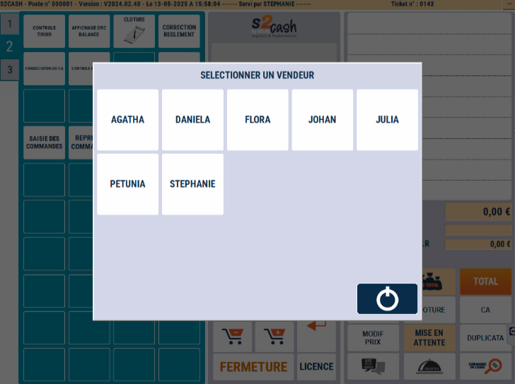
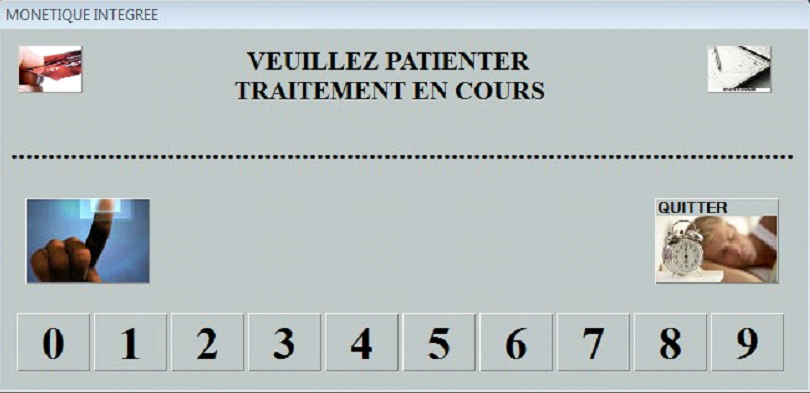

# Début de journée

## Sélection d'un vendeur
Lors de son lancement, ATLAS s’ouvre sur la sélection du vendeur :

## Monetique intégrée
Dans le cas où vous possédez de la monétique intégrée, la liaison va s’effectuer avec le centre bancaire et initialiser le terminal Carte Bancaire.

Veuillez ensuite saisir le montant de votre fonds de caisse pour comptabiliser les espèces et contrôler le tiroir en fin de journée. Un ticket s’imprime. 

Un ticket s’imprime.

Veuillez ensuite saisir le montant de votre fonds de caisse pour comptabiliser les espèces et contrôler le tiroir en fin de journée. Un ticket s’imprime.

Un ticket s’imprime. Vous le conservez dans le tiroir.
