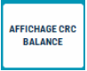

# Balance - Affichage CRC Balance

Une fonction de **contrôle de CRC** est présente sur le clavier de caisse, uniquement si vous avez une balance connectée ou si S2Cash by Atlas est intégré dans une balance de type PC. 

    

         
    

S2Cash by Atlas affiche la liste des devis clients déjà réalisés :

| Element       | Explication | 
|:-----------:|----|
|       |  En appuyant sur Calculer, le système contrôle que l’application installée est conforme à l’agrément LNE. S2Cash by Atlas recalcule la clé de contrôle et la compare au CRC fixé dans l’application. |
|       |  Un **ticket de contrôle** est imprimé. |
|       |  En cas de différence un message d’information est affiché à l’utilisateur et aucune pesée n’est possible sur la balance. |

:::warning
En cas de contrôle des autorités compétentes (DIRRECTE/DREETS), cette information est à fournir obligatoirement et cette touche ne doit jamais être ôtée du clavier de caisse sous peine de mise en non-conformité et d’être soumis à « vignette rouge » voire pire à « interdiction temporaire ».
:::

