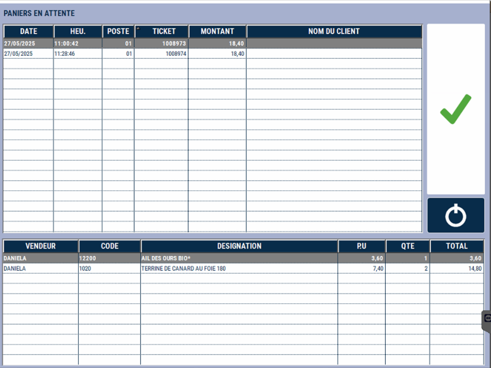

# Cloture de caisse

## Démarer la cloture 
Pour clôturer votre journée ou votre caisse, appuyez sur la touche ```CLOTURE```:

<div className="contenaireImg">
    
</div>

S2Cash by Atlas vous demande **de confirmer votre choix**.

<div className="contenaireImg">
    
</div>

## Pièces et billets de la journée 


Comptez et saisissez le détail des pièces et billets contenus dans votre tiroir-caisse.

<div className="contenaireImg">
    
</div>

Appuyez sur ```ENTREE``` pour passer à la ligne suivante.


Utilisez la gomme en cas d’erreur de saisie.


Vous pouvez vous positionner directement sur une ligne pour saisir une quantité.


S2Cash by Atlas calcule au fur et à mesure de la saisie le **total réel de votre tiroir-caisse**.


**Enregistrez votre saisie.**

## Ticket 


A la fin du comptage, ATLAS imprime un **ticket de détail du comptage.**


Il indique un écart de caisse, s’il y en a un.

<div className="contenaireImg">
    
</div>

En même temps, un message s’affiche vous indiquant la valeur et le sens de l’écart constaté par ATLAS.


**3 possibilités suivant vos paramètres :**


<li> Vous souhaitez recompter votre tiroir : Appuyez sur OUI </li>


<li> Vous souhaitez poursuivre la clôture : Appuyez sur NON </li>


<li> Il n’y a pas d’écart de caisse : le message n’apparaît pas, la clôture se poursuit.</li>


<div className="contenaireImg">
    
</div>

## Les détails


Le **détail de la clôture** s’affiche à l’écran.


<div className="contenaireImg">
    
</div>

## Quitter 


Appuyez sur ```QUITTER``` pour imprimer le ticket de clôture : 


<div className="contenaireImg">
    
</div>


Les compteurs de vente et de règlements sont remis à zéro.


L’application se ferme automatiquement.


Les différents tickets imprimés au cours de la clôture doivent être joints aux encaissements et remis au responsable de magasin.


**Une nouvelle journée ou session peut commencer.**