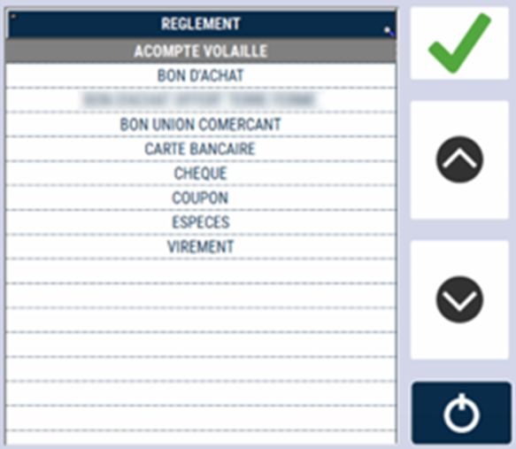
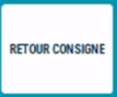
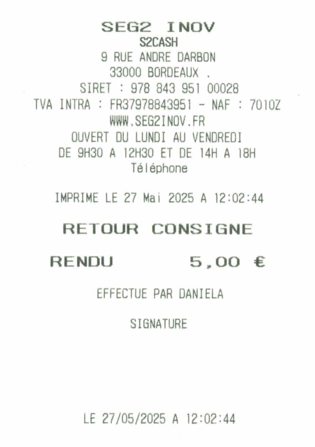

# Consignes

## Ajouter un paiement de consigne


Lors d’un prêt d’un produit associé à une vente (cocotte, plateau, etc.), on a la possibilité d’encaisser un paiement de consigne.

<div className="contenaireImg">
    
</div>


Le système demande alors de **sélectionner un client**.

| Une fois votre client saisi, renseignez le **prix de la consigne**.       | Saisissez le **mode de règlement de la consigne**. | 
|:-----------:|:----:|
|       |   |

:::warning
La consigne n’est pas un encaissement, car ce règlement sera redonné au client lors du retour. Le moyen de paiement « CARTE BANCAIRE » n’est donc pas autorisé.
:::

| Validez la fonction  | 2 tickets sont alors imprimés : 1 pour le client et 1 à conserver avec le règlement | 
|:-----------:|:----:|
|       |   |


## Retour de consigne

Lorsque le client retourne la consigne, sélectionner la touche ```RETOUR CONSIGNE``` :

<div className="contenaireImg">
    
</div>

S2Cash by Atlas affiche une fenêtre afin de scanner le ticket de consigne retourné par le client.


:::note
Vous pouvez aussi saisir le numéro du ticket si le code à barre est illisible.
:::

<div className="contenaireImg">
    
</div>


<div className="contenaireImg">
    
</div>

Après confirmation, le système imprime 2 tickets à signer par le client.

<li> 1 pour le client </li>
<li> 1 pour le magasin à archiver </li>

<div className="contenaireImg">
    
</div>
