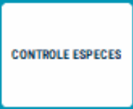

# Contrôle espèces


Vous avez la possibilité d’effectuer un comptage tiroir en cours de journée pour **contrôler le solde.**

Pour cela, **appuyez sur la touche** ```CONTROLE ESPECES``` :

<div className="contenaireImg">
    
</div>

Une fenêtre s’affiche alors pour effectuer un comptage du tiroir avec le solde théorique en caisse.


<div className="contenaireImg">
    
</div>

Le **détail du comptage** que vous venez d’effectuer s’imprime alors.


<div className="contenaireImg">
    
</div>


Ce comptage est effectué à titre de contrôle à un moment T.


S2Cash by Atlas vous redemande d’effectuer un comptage lors de la Clôture de caisse.