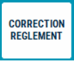
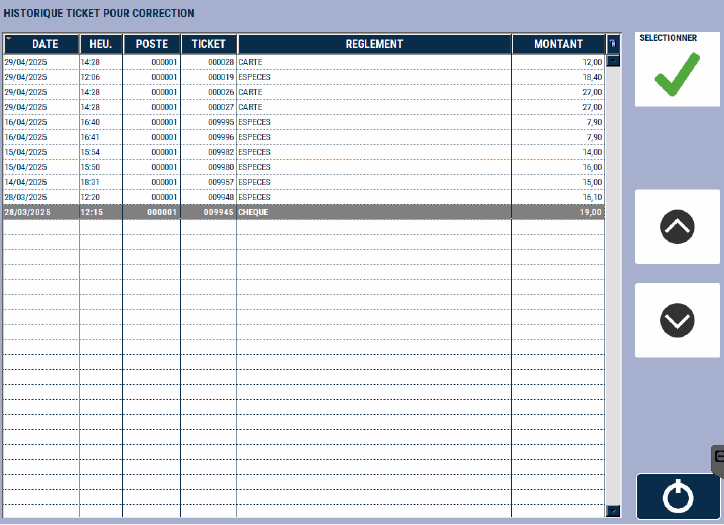
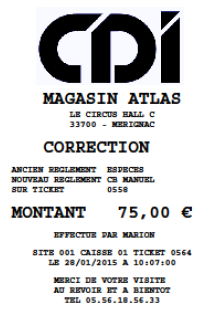

# Correction de règlement 

En cas d’erreur lors de l’encaissement, vous pouvez **ventiler le moyen de paiement sur un autre règlement** sans toucher au montant encaissé.

Cette fonction n’est accessible que sur la journée en cours, et sur une caisse non clôturée.

Pour corriger un moyen de règlement, **appuyez sur la touche** ```CORRECTION REGLEMENT``` : 

<div className="contenaireImg">
    
</div>

S2Cash by Atlas affiche alors la liste des encaissements de la journée (en fonction du paramétrage).

<div className="contenaireImg">
    
</div>


Sélectionnez la transaction à corriger et validez avec la touche :

<div className="contenaireImg">
    
</div>


S2Cash by Atlas vous demande de **sélectionner le nouveau moyen de paiement**. Veuillez conserver l’impression dans le tiroir.

<div className="contenaireImg">
    
</div>

Veuillez conserver les impressions dans le tiroir.

<div className="contenaireImg">
    
</div>