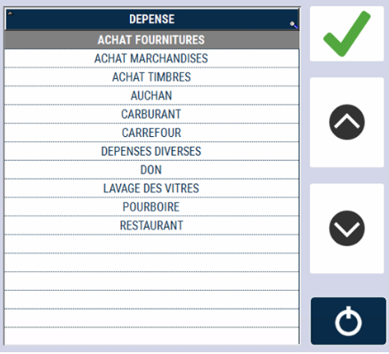
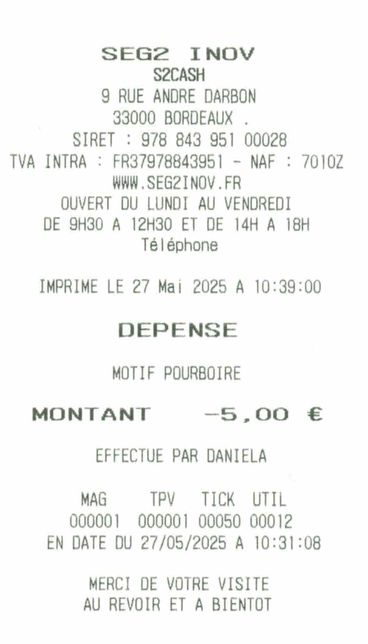

# Dépense de caisse

Une dépense de caisse est une **sortie d’espèces pour des opérations diverses**.

Pour effectuer une dépense de caisse,  appuyez sur la touche :

    

Les différents motifs de dépense s’affichent : 

    

Sélectionnez celle qui vous convient, puis saisissez le montant et validez par la touche : 

    

| Action       | Ticket |
|--------------|--------|
| |  |

Un ticket s’imprime. 

Vous devez conserver l’impression dans le tiroir. Cette opération apparaît sur le journal et la clôture de caisse.