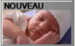

# Devis client

Pour effectuer un devis de prix à un client, **appuyer sur la touche** ``` DEVIS DE PRIX``` :


| Bouton       | Explication | 
|:-----------:|--------------|
|       |  Ecran global |
|       | Pour réaliser un nouveau devis, utilisez la touche ```NOUVEAU```|
|       |  Pour en modifier un, utiliser la touche ```MODIFICATION```. |
|       | Enfin, pour en supprimer un, utilisez la touche ```SUPPRESSION``` |


Une fois appuyé sur la touche  ```NOUVEAU``` , vous allez devoir sélectionner un client pour lequel le devis
va être réalisé.


La fenêtre suivante apparait. Vous allez pouvoir soit : 


| Bouton       | Explication | 
|:-----------:|----|
|       |  Ecran global |
|       |  Enregistrer le devis pour le reprendre plus tard. |
|       |  Rajouter des produits. |
|       |  Rentrer en modification sur la fiche du produit sélectionné. |
|       | Supprimer des lignes de commandes. |
|       | Imprimer votre devis sur une imprimante modèle A4 en réseau. |

