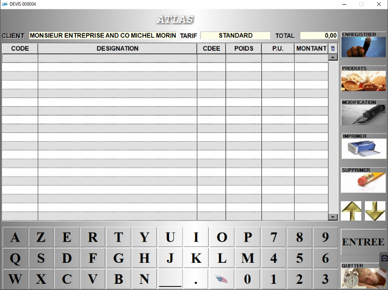
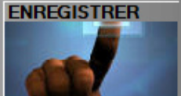
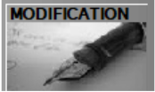
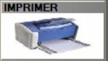

# Devis client

Pour effectuer un devis de prix à un client, **appuyer sur la touche** ```DEVIS``` :

    <div className="contenaireImg">
         
    </div>


S2Cash by Atlas affiche la liste des devis clients déjà réalisés :

| Bouton       | Explication | 
|:-----------:|----|
|       |  Ecran global |
|       |  Enregistrer le devis pour le reprendre plus tard. |
|       |  Rajouter des produits. |
|       |  Rentrer en modification sur la fiche du produit sélectionné. |
|       | Supprimer des lignes de commandes. |
|       | Imprimer votre devis sur une imprimante modèle A4 en réseau. |

