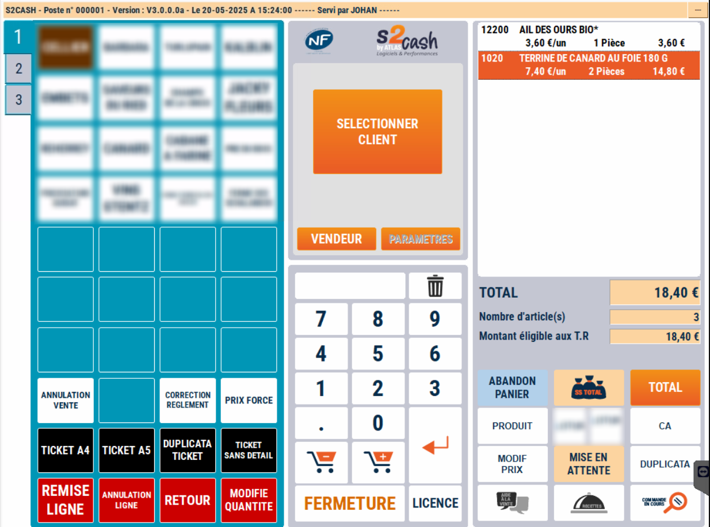
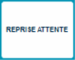

# Mise en attente d'une vente

## Comment faire ?
Cette fonction vous permet de mettre une vente en attente, de manière à libérer la caisse et passer à un autre client.

    <div className="contenaireImg">
         
    </div>

Par exemple :
<li> Un client a oublié d’acheter un produit </li>
<li> Un client a oublié son moyen de paiement </li>
<li> Un client conteste et vous attendez un responsable </li>

## Le ticket
Il n’y a pas de limite dans le délai de reprise d’un ticket en attente.

Selon le paramétrage : 

<li> S2Cash vy Atlas imprime 1 ou 2 tickets </li>
<li> Le ticket possède un CAB ou un numéro </li>
<li> Le nom du vendeur est connu </li>

Si vous aviez sélectionné un client lors de la vente, son nom apparaît sur le ticket en attente.

    <div className="contenaireImg">
         
    </div>

Le ticket en attente reprend : 

<li> Le détail de la vente et son total </li>
<li> La date et l’heure de la mise en attente </li>

### Ticket avec code à barre
Si le ticket possède un code à barre, vous pouvez le reprendre en lisant le ticket sinon ```appuyez sur la touche reprise attente``` : 

    <div className="contenaireImg">
         
    </div>


La liste des tickets en attente d’affiche. Vous sélectionnez le ticket souhaitez et validez par la touche :

    <div className="contenaireImg">
         
    </div>

## Liste des tickets en attente


Cette fonction peut également être utilisée pour la **préparation de commandes**.
Une fois la commande préparée et saisie en caisse, le ticket en attente est accroché sur le paquet.

    <div className="contenaireImg">
         
    </div>


N.B : Vous pouvez consulter la liste des tickets non encore repris dans ```ATLAS Gestion```.
Dès que le ticket est repris, il disparaît de cette liste.