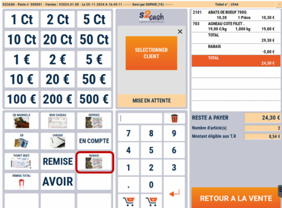
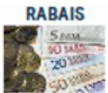

# Rabais sur total

Vous pouvez pratiquer **un rabais en valeur sur la totalité de la vente.**

<div className="contenaireImg">
    
</div>

- 1/ Saisissez le montant du rabais

- 2/ Appuyez sur la touche :


<div className="contenaireImg">
    
</div>

Une nouvelle ligne apparaît avec le montant déduit.


Le  ```reste à payer```  est mis à jour en haut de l’écran et sur la visu client.

Si votre rabais est incorrect, recommencez la fonction ou saisissez  ```0```  pour l’annuler. 

Le Montant du rabais est **ventilé sur chaque produit** en proportion de sa valeur dans le ticket.

Le rabais apparaît sur le ticket de caisse et sur la clôture de fin de journée.


:::danger
Le système ATLAS peut être configuré avec un **rabais fixe**, dans ce cas quel que soit le montant saisi du rabais, le système applique toujours **le montant paramétré**.
:::
