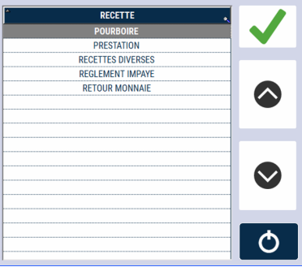
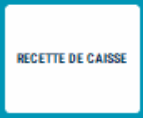
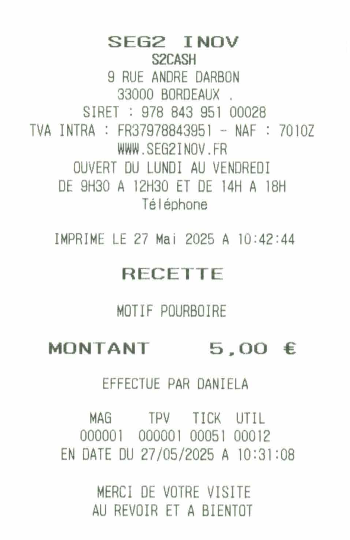

# Recette de caisse

Une recette de caisse est une **entrée d’espèces en dehors d’une vente**.


<div className="contenaireImg">
    
</div>


Pour effectuer une recette de caisse, appuyez sur
la touche ```RECETTE DE CAISSE``` :


<div className="contenaireImg">
    
</div>

Les différents motifs de recette s’affichent,
sélectionnez celle qui vous convient, puis
saisissez le montant et validez par la touche : 


<div className="contenaireImg">
    
</div>

| Action       | Impression |
|--------------|--------|
| |  |


Vous devez conserver l’impression dans le tiroir. Cette opération apparaît sur le journal et la clôture de caisse.