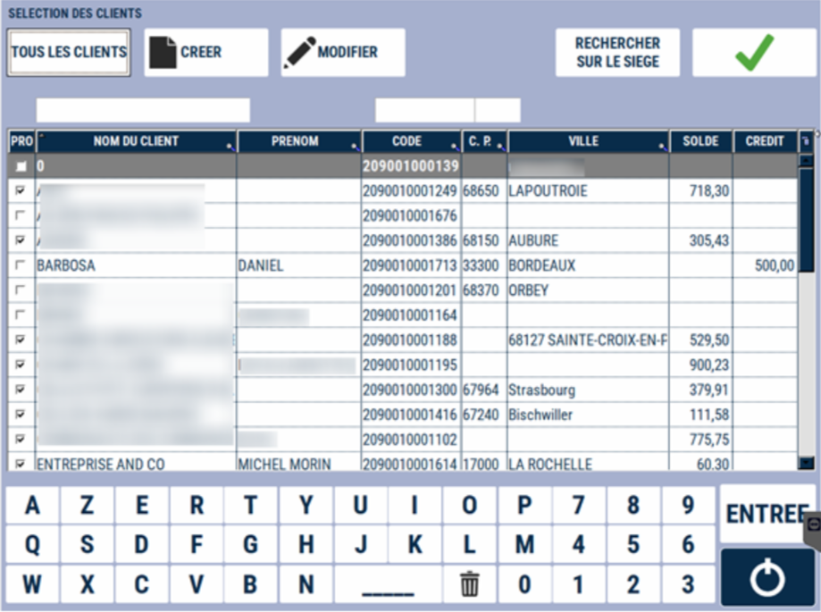

# Réglement client

Le règlement client est un **encaissement hors vente**.
Il est utilisé pour :
<li> Les clients dont les **paiements sont différés « En compte »** et qui règlent à posteriori ; </li>
<li> Les clients qui règlent un **acompte sur une commande.** </li> 

Le règlement d’un client vient **se soustraire de son solde**.

NB : <li> Un solde client positif, le client vous doit de l’argent ;</li>
<li>  Un solde client négatif, vous devez de l’argent à votre client. </li>

Appuyez sur la touche :

    

La fenêtre de sélection du client s’affiche (cf. [Lien vers tutorial recherche et création client](https://aide.seg2inov.eu/docs/client/recherche)).

Vous pouvez à ce niveau créer un client

    

Après avoir sélectionné le client, saisissez **le montant réglé par le Client et le moyen de paiement utilisé**. Validez.

| Montant réglé par le Client       | Moyen de paiement utilisé |
|--------------|--------|
| |  |

2 tickets s’impriment : 1 pour le client et 1 à conserver pour archive.