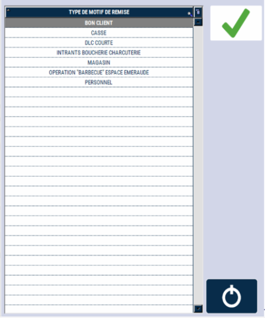

# Remise sur total


Vous pouvez pratiquer une **remise en pourcentage sur la totalité de la vente**.


    <div className="contenaireImg">
    
    </div>


- 1/ Saisissez le pourcentage de remise
- 2/ Appuyez sur la touche :

    <div className="contenaireImg">
    
    </div>

    <div className="contenaireImg">
        
    </div>


 S2Cash by Atlas vous demande alors de saisir le **motif de cette remise** avant de valider.
 
  Une nouvelle ligne apparaît avec le montant de la remise. Le  ```RESTE A PAYER``` est mis à jour en haut de l’écran et sur la visu client. 
  
  Si votre remise est incorrecte, recommencez la fonction ou saisissez  ```0```  pour l’annuler.
  
   Le montant de la remise est **ventilé sur chaque produit** en proportion de sa valeur dans le ticket. La remise totale apparaît sur le ticket de caisse et sur la clôture de fin de journée.


:::danger
Le système S2Cash by Atlas peut être configuré avec une remise totale fixe. Dans ce cas, quel que soit le montant saisi de la remise, le système applique toujours le montant paramétré.
::: 
