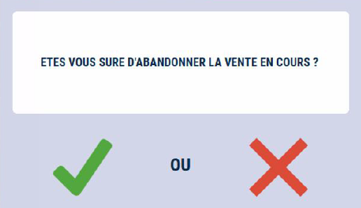

# Abandon de vente

Pour **abandonner un ticket** en cours de vente, appuyez sur la touche :

    

    
    

    

    
    

Un **ticket pour contrôle** est imprimé.

Cette fonction n’est **pas accessible après le total**.

L’abandon de vente n’apparaît pas sur la clôture de causse mais est enregistrée dans le journal électronique.
