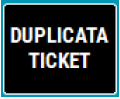
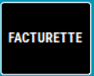
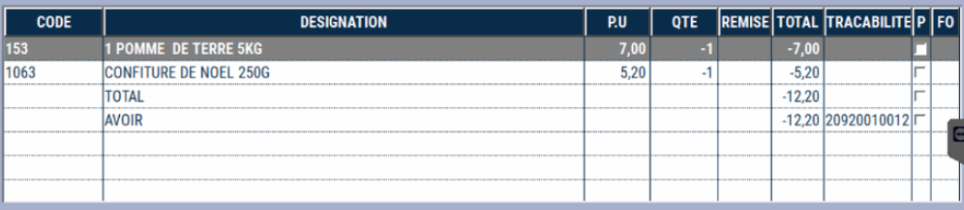

# Duplicata de ticket et de facture

Vous pouvez **réimprimer une vente du jour ou d’une journée précédente** à la demande.


3 possibilités vous sont offertes suivant votre configuration :

<li> Imprimer un ticket de caisse </li>

<li> Imprimer une facture en format A4 </li>

<li> Imprimer une facturette en format A5 si vous possédez un imprimante ticket multi fonction </li> 

<div className="contenaireImg">
    
</div>


| Bouton | Description | 
|:-----------:|-----------|
|| Pour réimprimer un ticket, appuyez sur la touche ```DUPLICATA TICKET``` Un ticket inscrit **DUPLICATA** s’imprime |
|| Pour imprimer une facture sur l’imprimante A4 en réseau avec la caisse, appuyez sur la touche ```FACTURE``` |
||Pour imprimer une facturette en format A5 sur l’imprimante multifonction de la caisse, appuyez sur la touche ```FACTURETTE```|

Dans les 3 cas, ATLAS affiche d’abord tous les tickets du jour par caissier ou caisse.

| Ecran | Description | 
|:-----------:|-----------|
|| Ecran global |
||Il est possible de rechercher un ticket sur une date antérieure. Tous les tickets de ce jour s’affichent, avec le détail en bas d’écran. |
||En bas de l’écran vous avez le détail du ticket sur lequel vous êtes positionné|
||Il est possible de faire une recherche sur un vendeur en particulier.|