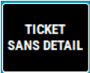
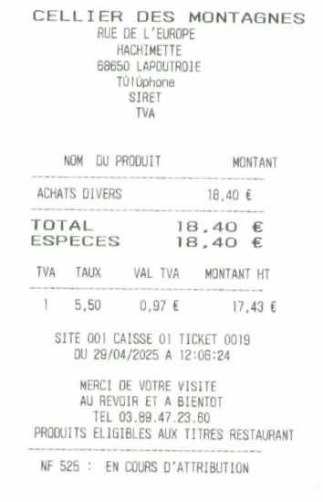

# Ticket sans détail


Lors d’une vente de produit alimentaire vous pouvez, à la demande du client, **imprimer un ticket sans détail.**


Pour imprimer un ticket sans détail sur l’imprimante ticket, appuyer sur la touche :

<div className="contenaireImg">
    
</div>

De la même façon que pour le duplicata, le système vous liste les tickets du jour afin de sélectionnez le bon.


<div className="contenaireImg">
    
</div>

Le libellé du ticket est modifié en « ```ticket sans détail``` » ou « ```achats divers``` » (paramétrable par l’équipe de développement du logiciel).

<div className="contenaireImg">
    
</div>

