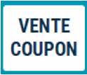
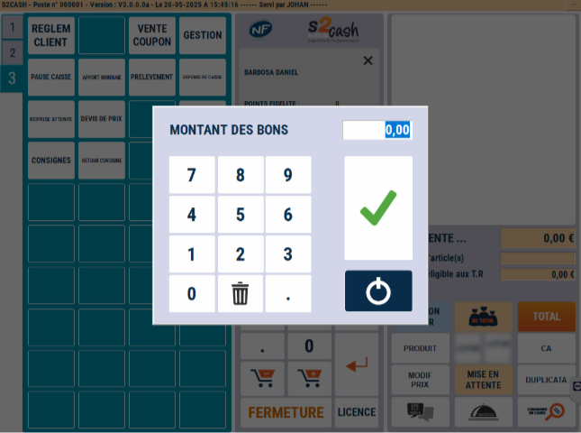
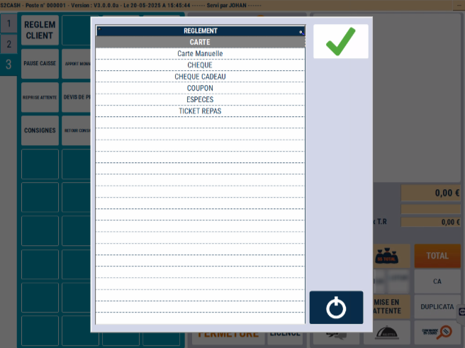
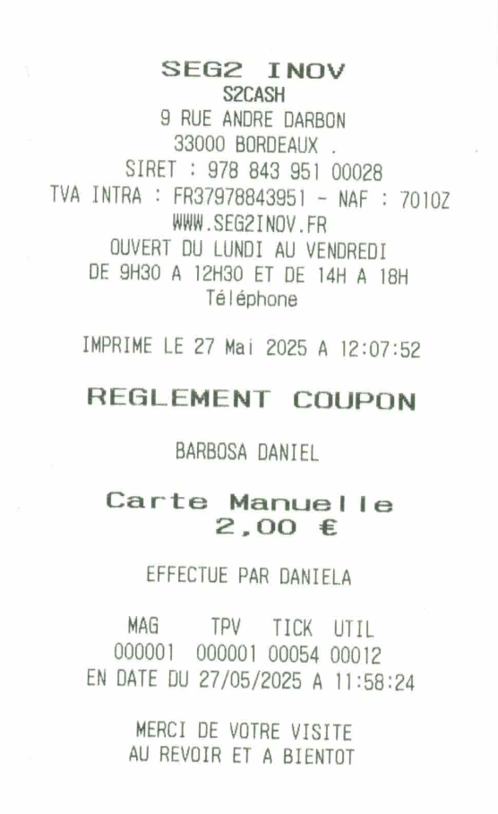
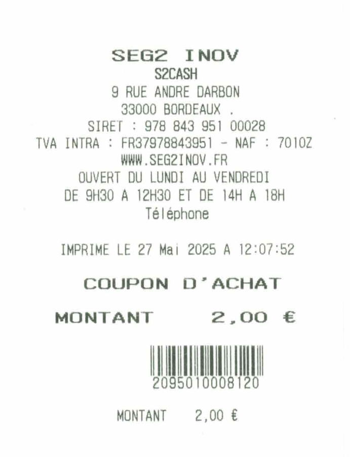

# Vente de coupon

Pour effectuer une vente de coupon, appuyez sur la touche ```VENTE COUPON```.

<div className="contenaireImg">
    
</div>

 ## Faire le coupon

 Dans un premier temps, vous devez sélectionner le client concerné.

| Saisissez ensuite le **montant des bons**  | Ainsi que la **quantité de bons** | 
|:-----------:|:----:|
|       |   |

|Pour finir, S2Cash by Atlas demande le **mode de règlement du client**  | Ainsi qu’une **confirmation** | 
|:-----------:|:----:|
|       |   |

## Les impressions

|S2Cash by Atlas sort en premier lieu une impression d’achat des coupons en double exemplaire.| Puis les coupons à la suite | 
|:-----------:|:----:|
|       |   |


Lorsque le client présente son coupon au moment d’un règlement, il ne vous reste qu’à le scanner au moment du total panier.


## Vente de coupon externe

En fonction du paramétrage mis en place, vous avez aussi la possibilité de **vendre des coupons imprimés à l’avance** par S2Cash by Atlas (cf. S2Cash by ATLAS Gestion). 


Dans ce cas, S2Cash by Atlas vous demande de **scanner les coupons pour les activer.**

A ce moment-là, vous avez la possibilité :

<li> Soit de scanner le code à barre du coupon déjà imprimé </li>
<li> Soit de le saisir manuellement. </li>

<div className="contenaireImg">
    
</div>