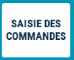
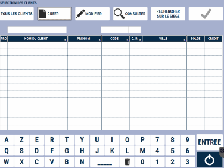
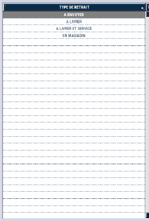
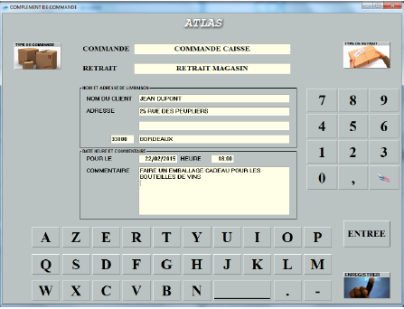
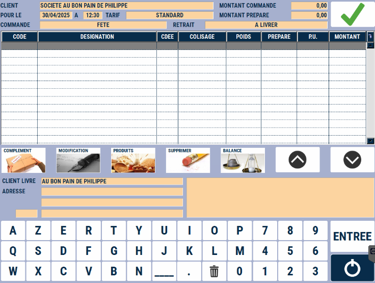
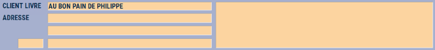
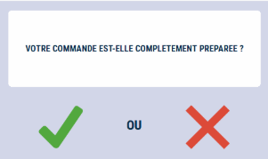

# Commande client

Il est possible de saisir sur la caisse **une commande client** en renseignant les informations suivantes :

<li> La date de livraison </li>

<li>Le numéro de commande </li>

<li> Le montant commandé </li>

<li> Le montant préparé </li>

<li> Le nom du client </li> 


    <div className="contenaireImg">
    
    </div>

La colonne « P » indique si la commande est préparée en totalité.


N.B : seules les commandes préparées en totalité peuvent être récupérées en caisse.

Pour créer une nouvelle commande, vous devez sélectionnez :
    <div className="contenaireImg">
    
    </div>

| Le client | Le type de commande  | Le type de retrait |
|-----------|-----------|-----------|
|| ||

Une nouvelle fenêtre s’affiche alors vous permettant de renseigner des informations diverses telles qu’un nom et une adresse de livraison différente de celle du client qui passe la commande ; ou encore de renseigner un commentaire libre ainsi qu’une heure de livraison.

    <div className="contenaireImg">
    
    </div>

Une fois vos informations renseignées, validez avec la touche :


    <div className="contenaireImg">
    
    </div>

Saisissez les produits ainsi que les quantités commandées. A ce niveau, vous pouvez : 

| Ecran | Description  | 
|:-----------:|-----------|
|| Ecran global|
|| Consulter la fiche produit|
||Modifier le produit sélectionné |
||Consulter les commentaires saisis lors de la commande |
||La touche complément permet de **modifier les informations saisies** lors de la création de la commande (comme l’adresse ou les commentaires). Pensez à enregistrer vos modifications. |

Lorsque vous enregistrez votre saisie, S2Cash by Atlas vous demande si la préparation est terminée.
    <div className="contenaireImg">
    
    </div>

Si vous répondez « OUI », le « P » est coché dans la liste et la commande peut-être repise en caisse via le bouton reprise de commande.

    <div className="contenaireImg">
    
    </div>


Appuyez sur la touche ```MODIFICATION``` pour entrer dans une commande en cours, afin de la compléter ou de la modifier.