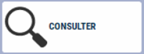

# Recherche Client
Pour associer un **Client** à votre **vente**, vous devez le sélectionner **avant le Total** :

<li> en lisant son badge </li>


<li> ou en appuyant sur la touche ```SELECTIONNER CLIENT```. </li>


    <div className="contenaireImg">
    
    </div>


| Bouton       | Explication |
|:-----------:|----|
|      | Fait apparaitre la liste de tous les clients |
|      | Positionnez-vous sur le client et sélectionnez-le par la touche : |
|      | Vous pouvez également rechercher un client en saisissant les premières lettres de son nom (ou son code, code postal) puis Entrée. |
|      | Permet de consulter le détail de la fiche client |
|      | Vous pouvez à ce niveau créer un client en appuyant sur la touche : NB : Le titre et le nom suffisent pour l’enregistrement d’un client. |
|      | Vous pourrez revenir sur la fiche ultérieurement pour la compléter|
