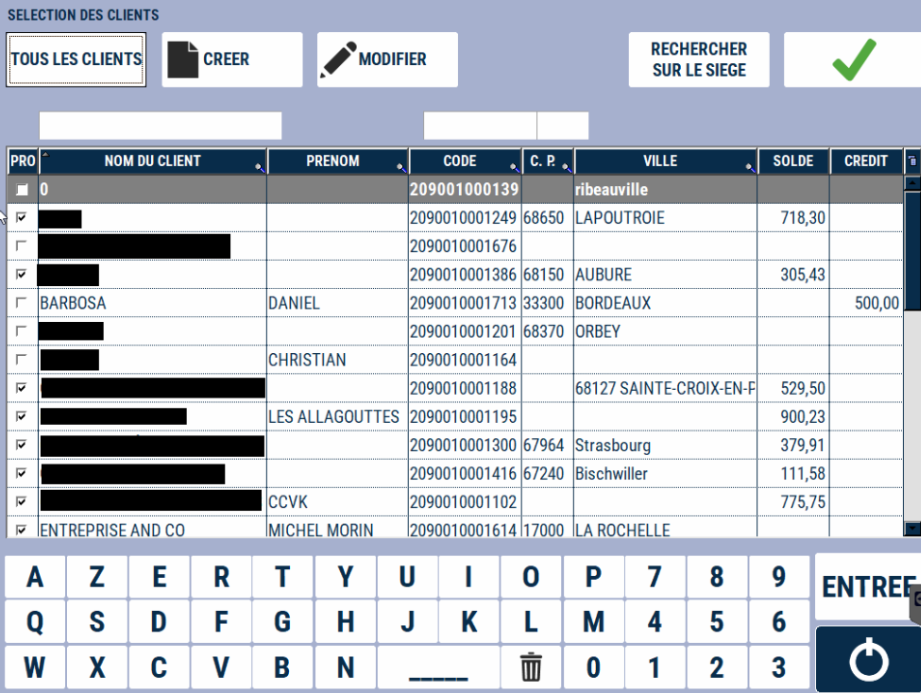
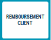
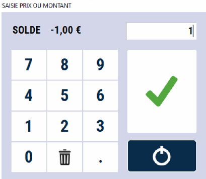
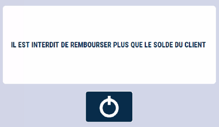

 # Remboursement client

 Le remboursement client est un **décaissement pour ajuster un solde client.**
<li> Il ne peut être utilisé que si le solde du client est négatif. </li>

    

Appuyez sur la touche :

    

La fenêtre de sélection du client s’affiche (cf. [Lien vers tutorial recherche et création client](https://aide.seg2inov.eu/docs/client/recherche)).

| Action       | Description |
|--------------|--------|
| | Après avoir sélectionné le client, saisissez le montant que vous souhaitez rembourser. Validez. |
| | S2Cash by Atlas contrôle le montant maximum autorisé en remboursement par rapport au solde du client. |

2 tickets s’impriment : 1 pour le client et 1 à conserver pour archive.