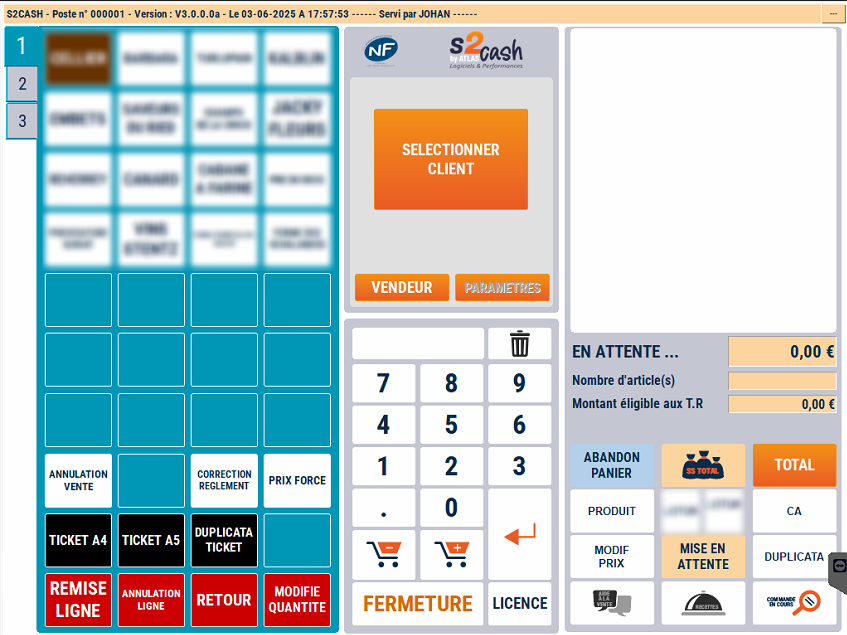
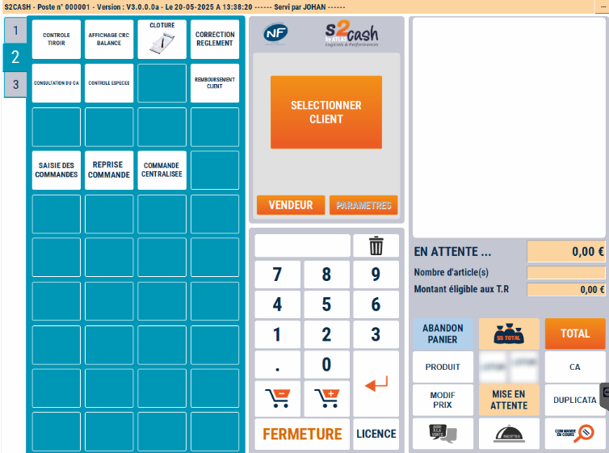

# Aspect visuel
## Accéder aux écrans après le Total du ticket

|  |   |  | 
|-----------|-----------|-----------|
|Le 1er écran pour la **vente de produits**.| Le 2ème écran pour les fonctions diverses de caisse Pour basculer dans la **Gestion** appuyez sur le bouton : 

| Le 3ème écran, accessible **après le Total du ticket**, pour les remises sur le total et le règlement de la transaction. |

## Un mode CAISSE 4 écrans 
|  |  |
|-----------|-----------|
|Le 4ème écran, accessible **après le Total du ticket** pour les remises sur le total et le règlement de la transaction. | En mode balance, on retrouve les mêmes configurations que le mode caisse en 3 ou 4 écrans, mais avec une barre de pesée en plus (située en haut ou sur le côté en fonction du modèle de la balance) |

&nbsp;

:::note
Ces configurations d’écrans ne sont que des exemples. Toutes les touches sont modifiables via le module ATLAS GESTION.
:::
:::warning
Comme pour les ventes, toutes les opérations qui nécessitent une manipulation des espèces sont enregistrées dans la Caisse, de façon à ce que le tiroir soit juste en fin de journée.
Atlas enregistre donc :
<li>Les dépenses de caisse</li><li>Les recettes de caisse</li><li>Les prélèvements d’espèces</li><li>Les apports de monnaie</li><li>Les règlements client</li><li>Les remboursements client</li>
:::

