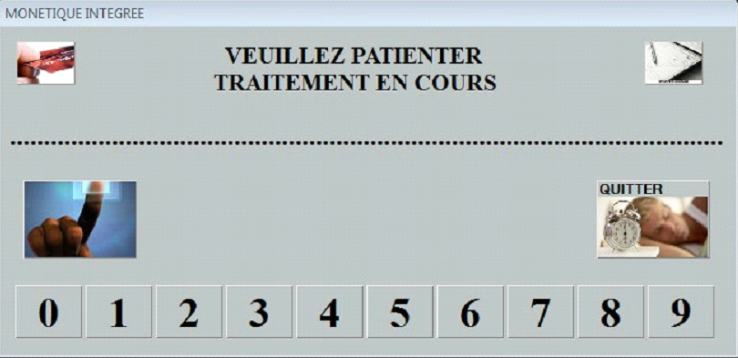
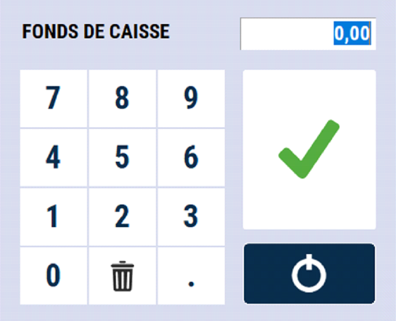

# Début de journée

## Sélection d'un vendeur
Lors de son lancement, S2Cash by ATLAS s’ouvre sur la sélection du vendeur :
    

    
    

## Monetique intégrée
Dans le cas où vous possédez de la monétique intégrée, la liaison va s’effectuer avec le centre bancaire et initialiser le terminal Carte Bancaire.

    

    
    

Veuillez ensuite **saisir le montant de votre fonds de caisse** pour comptabiliser les espèces et contrôler le tiroir en fin de journée. 

    

    
    

Un ticket s’imprime. Veuillez ensuite **saisir** le montant de votre **fonds de caisse** pour **comptabiliser** les espèces et contrôler le tiroir en fin de journée.

Vous le conservez dans le tiroir.
