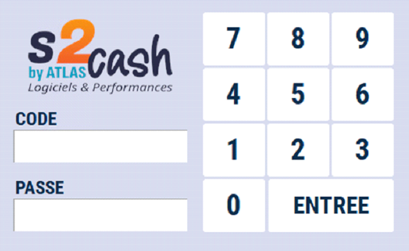

# Sélection d'un vendeur

## Au démarage

En fonction du paramétrage, Atlas peut soit démarrer sur un vendeur standard (généralement appelé CAISSE ou BALANCE) ou vous demander de sélectionner un vendeur pour ouvrir le logiciel.

Veuillez-vous identifier en saisissant votre code et votre mot de passe ou passez votre Badge devant le lecteur de code à barre.

 
:::warning
Attention, ATLAS contrôle que vous n’êtes pas déjà assigné à une autre caisse.
:::

La caisse va s’ouvrir et imprimer un ticket d’ouverture caisse.

## Configurations vendeur

Si ATLAS est configuré pour démarrer sur un vendeur standard, plusieurs configurations vendeur sont possibles (cf documentation ATLAS GESTION). Le système peut alors vous demander de vous identifier :

⦁	soit au début de la vente.

⦁	soit à chaque sélection de produit.

⦁	soit au moment du total du ticket.

Dans ces 3 cas, 2 modes d’identification sont possibles :

|  |  | 
|-----------|-----------|
|Soit une identification vendeur par nom| Soit une identification vendeur par badge et/ou code |
