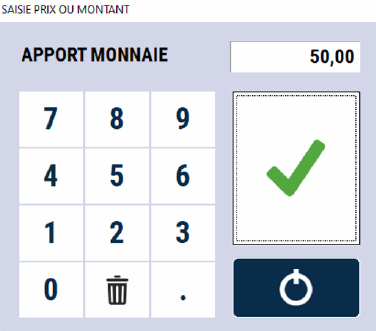
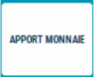

# Apport de monnaie

Cette fonction permet d’ajouter de la monnaie dans le tiroir en cours de journée.

    

Il est important d’utiliser cette fonction pour que le tiroir soit juste en fin de journée et que la gestion coffre soit équilibrée.
<li> Appuyez sur la touche : </li>

    

<li>Saisissez le montant total de l’apport </li>
<li> Validez votre saisie </li>

Il y a alors une impression pour contrôle. L’apport de monnaie apparaît distinctement sur la clôture de caisse.