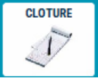
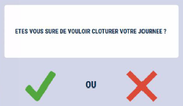
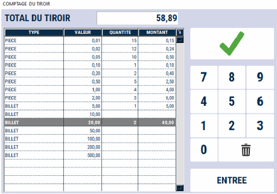
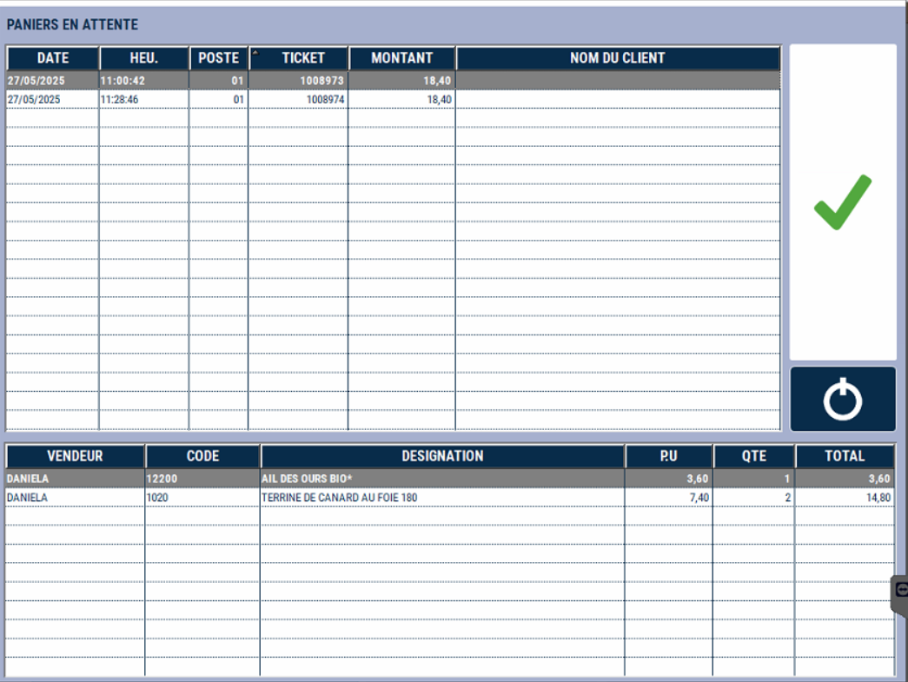
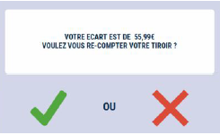
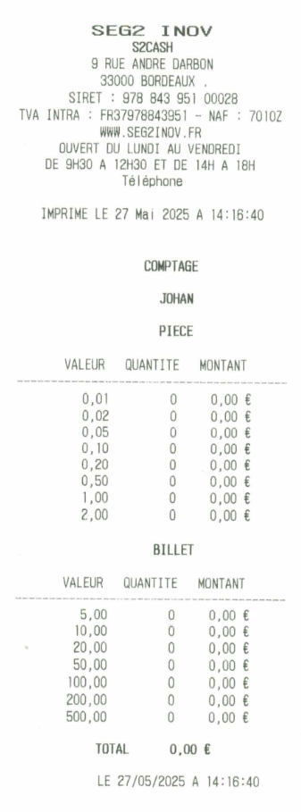

# Clôture de caisse

## Démarrer la clôture
Pour clôturer votre journée ou votre caisse, appuyez sur la touche ```CLÔTURE```:

<div className="contenaireImg">
    
</div>

S2Cash vous demande **de confirmer votre choix**.

<div className="contenaireImg">
    
</div>

## Pièces et billets de la journée 


Comptez et saisissez le **détail des pièces et billets** contenus dans votre tiroir-caisse.

<div className="contenaireImg">
    
</div>

<li> Appuyez sur ```ENTREE``` pour passer à la ligne suivante. </li>

<li> Utilisez la gomme en cas d’erreur de saisie. </li>

<li> Vous pouvez vous positionner directement sur une ligne pour saisir une quantité. </li>

---------------------------------------
S2Cash calcule au fur et à mesure de la saisie le **total réel de votre tiroir-caisse**.

:::note
Pensez à **enregistrer votre saisie.**
:::

## Le détail

Le **détail de la clôture** s’affiche à l’écran.

<div className="contenaireImg">
    
</div>


## Impression détail

A la fin du comptage, s'il y a un écrat de caisse, ce dernier est imprimé et ce message s'affiche sur la caisse :

<div className="contenaireImg">
    
</div>


**3 possibilités suivant vos paramètres :**


<li> Vous souhaitez recompter votre tiroir : Appuyez sur ```OUI``` </li>


<li> Vous souhaitez poursuivre la clôture : Appuyez sur ```NON``` </li>


<li> Il n’y a pas d’écart de caisse : le message n’apparaît pas, la clôture se poursuit.</li>

-----------

Le **détail du comptage** est imprimé.

<div className="contenaireImg">
    
</div>


## Quitter 

Appuyez sur ```QUITTER``` pour obtenir l'impression de clôture : 


<div className="contenaireImg">
    
</div>

:::note
Les différentes impressions liées à la clôture doivent être **joints aux encaissements** et **remis au responsable de magasin**.
:::

Les compteurs de vente et de règlements sont remis à zéro. L’application se ferme automatiquement.

**Une nouvelle journée ou session peut commencer.**