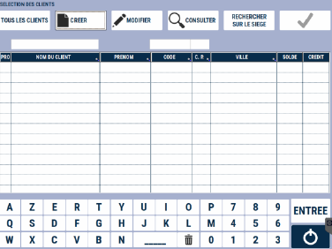
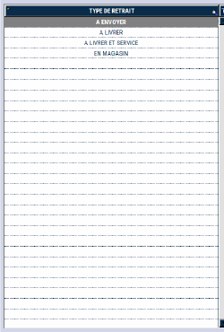

# Commande client

<div className="contenaireImg">
    
    </div>

Il est possible de saisir sur la caisse **une commande client** en renseignant les informations suivantes :

<li> La date de livraison </li>

<li>Le numéro de commande </li>

<li> Le montant commandé </li>

<li> Le montant préparé </li>

<li> Le nom du client </li> 

## Créer une nouvelle commande 

Pour créer une nouvelle commande, vous devez sélectionnez :
    <div className="contenaireImg">
    
    </div>

Ensuite, vous pouvez sélectionner : 

| Le client | Le type de commande  | Le type de retrait |
|-----------|-----------|-----------|
|| ||

:::tip 
La **liste des types de commande** et la **liste des types de retrait** sont modifiables depuis la gestion. Pour plus d'informations, cliquez sur le lien suivant : [Manuel de gestion - Les commandes](https://aide.seg2inov.fr/docs/category/les-commandes). 
:::

Une nouvelle fenêtre s’affiche alors vous permettant de renseigner des informations diverses telles que : 
<li> un **nom** </li>
<li> une **adresse de livraison**, si celle-ci est différente de l'adresse du client qui passe la commande </li>
<li> un **commentaire libre** </li>
<li> une **heure de livraison** </li>

| Visuel caisse | Visuel balance |
|:-----------:|:-----------:|
| |    |

Une fois vos informations renseignées, validez avec la touche :

<div className="contenaireImg">
    
    </div>

## Saisir la commande

 Vous pouvez alors saisir votre commande. 

<div className="contenaireImg">
    
    </div>

| Ecran | Description  | 
|:-----------:|-----------|
|| **Ajouter** des produits à la commande|
||**Modifier le produit** sélectionné |
||**Consulter les commentaires** saisis lors de la commande |
||La touche complément permet de **modifier les informations saisies** lors de la création de la commande (comme l’adresse ou les commentaires). |

:::note
Pensez à enregistrer vos modifications ! 
:::

----------------------------

Lorsque vous enregistrez votre saisie, S2Cash vous demande si la **préparation est terminée**.
    <div className="contenaireImg">
    
    </div>

Si vous répondez « ```OUI``` », la colonne « **P** », indiquant si la commande a été préparée en totalité sera **cochée dans la liste**. 

Si vous rapondez « ```NON``` », la commande est simplement **enregistrée**, et pourra être **complétée plus tard**. 

:::note
Seules les commandes préparées en totalité peuvent être récupérées en caisse.
:::