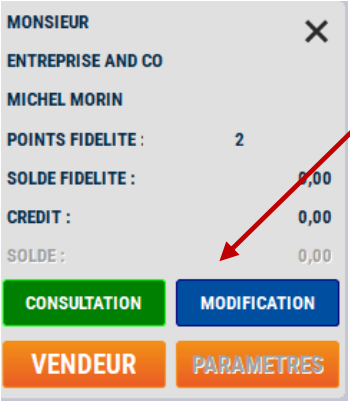

# Reprise de commande

Les commandes peuvent être **reprises en caisse** au moment où les clients viennent les chercher et les régler. 

## Depuis la touche REPRISE COMMANDE

Appuyez sur la touche :

<div className="contenaireImg">
         
    </div>

S2Cash affiche alors la liste des commandes.

<div className="contenaireImg">
         
    </div>

:::warning
Seules les commandes préparées complètement apparaissent.
:::

En bas de l’écran, vous avez le **détail de la commande sur laquelle vous êtes positionné**.

Positionnez-vous sur la commande recherchée et **validez** votre sélection par la touche : 

<div className="contenaireImg">
         
    </div>

Le **détail de la commande est repris en caisse**.

Le **nom du client** apparait.

<div className="contenaireImg">
         
    </div>

## Depuis la sélection d'une fiche client

Depuis la **caisse**, vous pouvez **rechercher un client**, puis appuyez sur la touche ```MODIFICATION``` pour entrer dans une commande en cours, afin de la **compléter ou de la modifier**.

<div className="contenaireImg">
    
    </div>

-----------------------------------

Dans les 2 cas, vous pouvez **vendre d’autres produits, en annuler ou apporter des modifications de prix ou de quantité** comme sur une transaction classique.

Clôturez votre vente comme une vente standard. Les commandes reprises **disparaissent** de la liste.