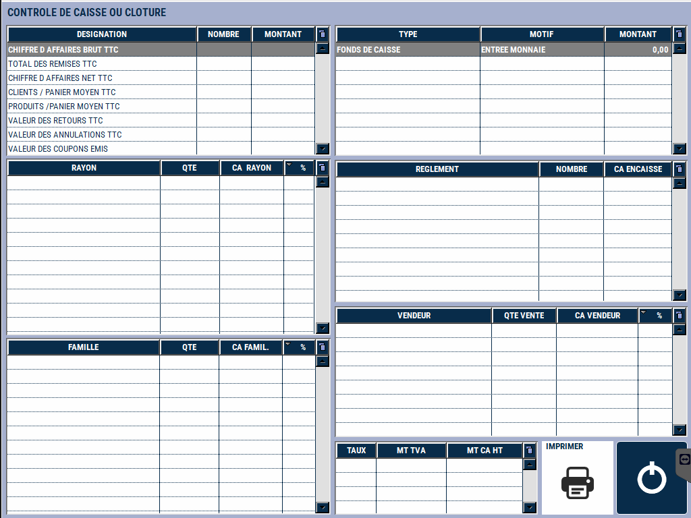

# Consultation du chiffre d'affaires 

Depuis la caisse, vous pouvez consulter le chiffre d’affaires du poste en temps réel, en cliquant sur la touche CA :

    
    

    
    

  Vous pouvez imprimer ces informations. 

:::note 
Vous pouvez consulter le chiffre d'affaires de tout le magasin depuis la gestion. *[Manuel de gestion - Consultation de caisse.](https://aide.seg2inov.fr/docs/manuel-gestion/gestion-de-caisse/consultation-caisse)*
:::

