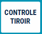
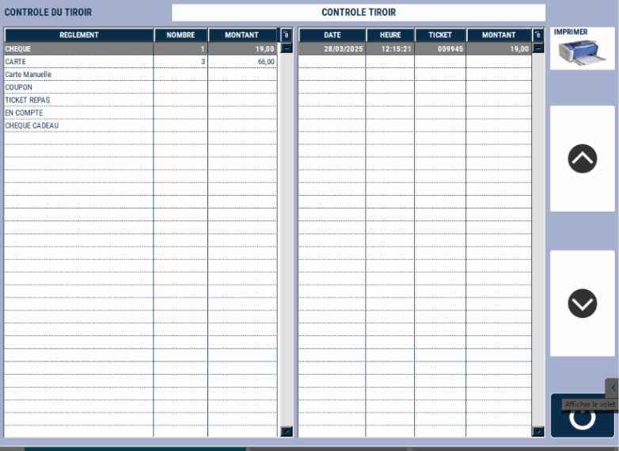
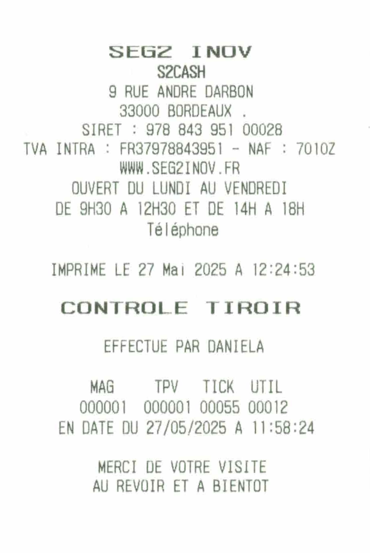

# Contrôle tiroir

Vous pouvez effectuer un **contrôle de votre tiroir en cours de journée**, afin de vérifier votre tiroir sur les **règlements autres que les espèces**.

:::tip
Le contrôle tiroir est recommandé avant de clôturer votre caisse.
:::

Pour pointer tous les règlements autres que les espèces, appuyez sur la touche ```CONTROLE TIROIR```.

<div className="contenaireImg">
    
</div>

S2Cash affiche tous les **tickets encaissés par moyen de paiement**, avec le détail.

**A gauche :** le total des encaissements par moyen de paiement


**A droite :** le détail de tous les encaissements de ce moyen de paiement.


<div className="contenaireImg">
    
</div>

:::note
Il est possible à ce moment de faire une correction de règlement.
:::

Dans la procédure de clôture, le contrôle tiroir doit être **imprimé** et **joint à la clôture**.

<div className="contenaireImg">
    
</div>
