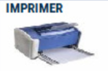

# Contrôle tiroir

Vous pouvez effectuer un contrôle de votre tiroir en cours de journée, afin de vérifier votre tiroir sur les règlements autres que les espèces.
Le Contrôle Tiroir est recommandé avant de clôturer votre caisse.

Pour pointer tous les règlements autres que les espèces, appuyez sur la touche ```CONTROLE TIROIR```.

<div className="contenaireImg">
    
</div>

S2Cash by Atlas affiche tous les tickets encaissés par moyen de paiement, avec le détail.

**A gauche :** le total des encaissements par moyen de paiement


**A droite :** le détail de tous les encaissements de ce moyen de paiement.


<div className="contenaireImg">
    
</div>

Le contrôle tiroir permet de pointer les chèques, tickets restaurant, tickets de carte bancaire, etc…

Il est possible à ce moment de faire une correction de règlement.

<div className="contenaireImg">
    
</div>

Dans la procédure de clôture, le contrôle tiroir doit être imprimé et joint à la clôture.


<div className="contenaireImg">
    
</div>
