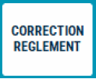
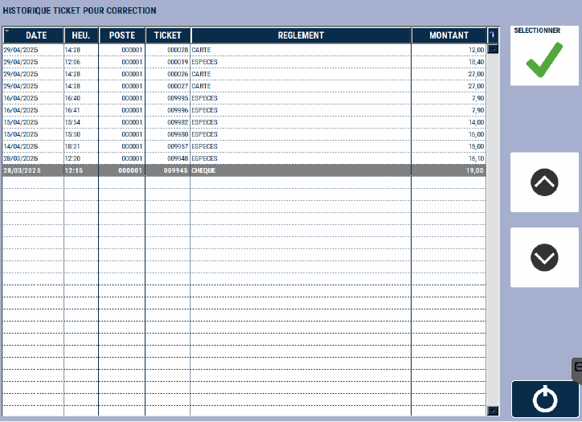
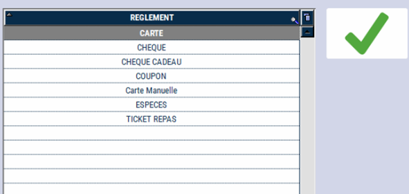

# Correction de règlement 

## Corriger un règlement 

En cas d’erreur lors de l’encaissement, vous pouvez **ventiler le moyen de paiement sur un autre règlement** sans toucher au montant encaissé.

Cette fonction n’est accessible **que sur la journée en cours**, et sur une **caisse non clôturée**.

Pour corriger un moyen de règlement, **appuyez sur la touche** ```CORRECTION REGLEMENT``` : 

<div className="contenaireImg">
    
</div>

S2Cash affiche alors la **liste des encaissements de la journée** (en fonction du paramétrage).

<div className="contenaireImg">
    
</div>

Sélectionnez la transaction à corriger et validez avec la touche :

<div className="contenaireImg">
    
</div>

S2Cash vous demande de **sélectionner le nouveau moyen de paiement**. 

<div className="contenaireImg">
    
</div>

La correction de règlement passe par **l’annulation de la 1e vente**, puis par une **2e vente identique avec le nouveau moyen de règlement**. 

Après la correction de règlement, 2 tickets sont alors imprimés : 1 ticket d’annulation et 1 nouveau ticket de vente avec le nouveau mode de règlement. 

:::note
Veuillez conserver l'impression d'annulation dans le tiroir.
:::

## Message d'erreur

La fonction "Correction de règlement" affiche la **liste des tickets de la journée en cours**. 

Si vous souhaitez faire une correction de règlement mais qu'**aucune transaction n'a été effectuée**, la caisse affiche ce message : 

<div className="contenaireImg">
    
</div>

Vous ne pouvez corriger un règlement que si une transaction a eu lieu. 