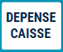

# Dépense de caisse

Une dépense de caisse est une **sortie d’espèces pour des opérations diverses**.

Pour effectuer une dépense de caisse,  appuyez sur la touche :

    

Les différents **motifs** de dépense s’affichent : 

    

:::tip
La liste des motifs de dépenses est modifiable depuis la gestion. Pour plus d'informations, cliquez sur le lien suivant : [Manuel de gestion - Mise à jour des dépenses](https://aide.seg2inov.fr/docs/manuel-gestion/gestion-de-caisse/maj-depenses).
:::

Sélectionnez celui qui vous convient, puis saisissez le **montant** : 

    

Et **validez** par la touche : 

    

Cela génère une **impression**, à conserver dans le tiroir. 

    

:::note
Cette opération apparaît sur le **journal** et la **clôture de caisse**.
:::