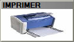

# Devis client

Pour effectuer un devis de prix à un client, **appuyer sur la touche** ``` DEVIS DE PRIX``` :

| Visuel caisse | Visuel balance |
|:-----------:|:-----------:|
| |    |


| Bouton caisse | Bouton balance | Explication | 
|:-----------:|:--------------:|------------------|
|  |  |**Créer** un nouveau devis. |
|  |   |**Modifier** un devis.  |
|  |  |**Supprimer** un devis. |

------------------

Lorsque vous créez un nouveau devis, vous devez **sélectionner un client** pour lequel le devis va être réalisé.

La fenêtre suivante apparait :

| Visuel caisse | Visuel balance |
|:-----------:|:-----------:|
| |    |


Vous allez pouvoir soit : 

| Bouton caisse | Bouton balance | Explication | 
|:-----------:|:----:|---------------------------|
|  |  |  **Enregistrer** le devis pour le reprendre plus tard. |
|  |  | **Rajouter** des produits. |
|  |  | Rentrer en **modification sur la fiche du produit** sélectionné. |
|  | | **Supprimer des lignes** de devis. |
|  |  |**Imprimer votre devis** sur une imprimante modèle A4 en réseau. |