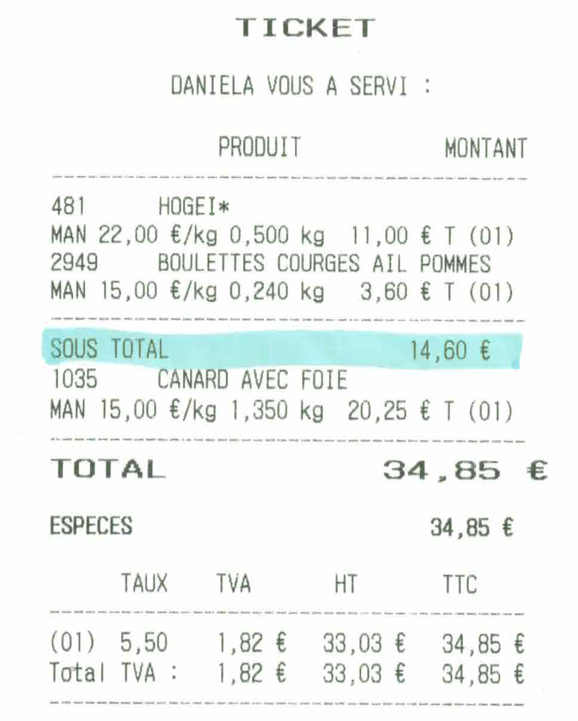

# Le sous-total

La touche ```SOUS-TOTAL``` sert à effectuer une **valorisation des produits** saisis à un ou plusieurs endroit(s) donné(s) sur le ticket de caisse.

    <div className="contenaireImg">
    
    </div>

| Panier sur la caisse | Ticket |
|-----------|----|
|  |   | 