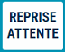

# Mise en attente d'une vente

## Comment faire ?
Cette fonction vous permet de mettre une vente en attente, de manière à libérer la caisse et passer à un autre client.

    <div className="contenaireImg">
         
    </div>

### Par exemple :
<li> Un client a oublié d’acheter un produit </li>
<li> Un client a oublié son moyen de paiement </li>
<li> Un client conteste et vous attendez un responsable </li>


:::tip
Il n’y a pas de limite dans le délai de reprise d'un panier en attente
:::


### Selon le paramétrage : 

<li> S2Cash by Atlas fait 1 ou 2 impressions </li>
<li> Ces impressions possèdent un CAB ou un numéro</li>
<li> Le nom du vendeur est connu </li>


Si vous aviez sélectionné un client lors de la vente, son nom apparaît sur le panier en attente.


    <div className="contenaireImg">
         
    </div>


L’impression du panier en attente reprend :

<li> Le détail de la vente et son total </li>
<li> La date et l’heure de la mise en attente </li>

### Impression avec code à barres


Si l’impression possède un code à barres, vous pouvez le reprendre en le scannant. Sinon, appuyez sur la touche ```REPRISE ATTENTE```.


    <div className="contenaireImg">
         
    </div>


La liste des paniers en attente s’affiche. Sélectionnez le panier souhaité et validez par la touche : 

    <div className="contenaireImg">
         
    </div>

## Liste des paniers en attente

Cette fenêtre affiche tous les paniers mis en attente, et non repris en caisse. 

    <div className="contenaireImg">
         
    </div>

Cette fonction peut également être utilisée pour la **préparation de commandes**.

Une fois la commande préparée et saisie en caisse, l’impression du panier en attente est accrochée sur le paquet.

:::note
Vous pouvez consulter la liste des paniers non encore repris dans S2CASH BY ATLAS - GESTION.
:::

Dès que le panier est repris, il disparaît de cette liste.