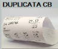
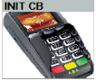
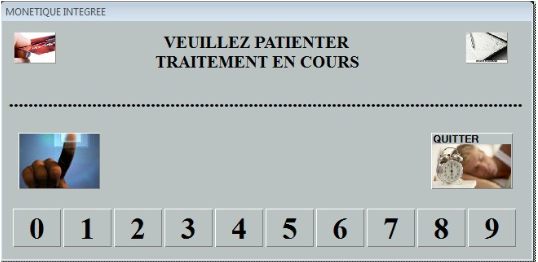

# Monétique Integrée – Init CB et Duplicata CB

Dans le cas d’une configuration en Monétique Intégrée, 2 nouveaux boutons sont accessibles sur l’écran de caisse :

## Duplicata CB

<li> La touche ```DUPLICATA CB``` permet de **réimprimer le dernier ticket de transaction bancaire** : </li>

    <div className="contenaireImg">
    
    </div>

:::warning
On ne peut réimprimer **QUE le ticket de la dernière transaction**.
:::

:::note
Si vous utilisez au préalable la touche ```INIT CB```, aucun ticket ne sera imprimé.
:::

## Init. CB

<li> La touche ```INIT CB``` **force la réinitialisation du terminal** de carte bancaire et effectue un appel sur le serveur de monétique. </li>

    <div className="contenaireImg">
    
    </div>

Lors de l’appel au serveur monétique, la fenêtre ci-dessous apparait :

<div className="contenaireImg">
    
    </div>