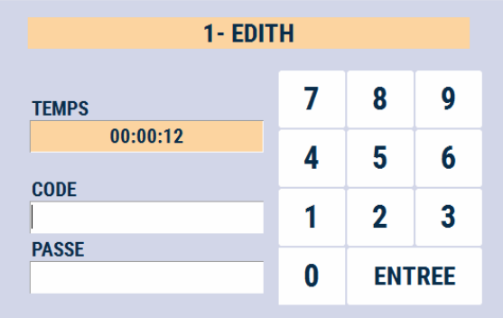

# Pause caisse

Pour mettre la caisse en pause, sans la clôturer, appuyer sur la touche ```PAUSE CAISSE```.

<div className="contenaireImg">
    
</div>

Une fenêtre affiche l’utilisateur et le **temps de pause** s’incrémente.

<div className="contenaireImg">
    
</div>

En fonction du **paramétrage** mis en place :
<li> Seule la personne ayant mis la caisse en pause peut la débloquer </li>
<li> N’importe quel utilisateur peut enlever la pause </li>


