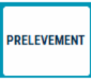
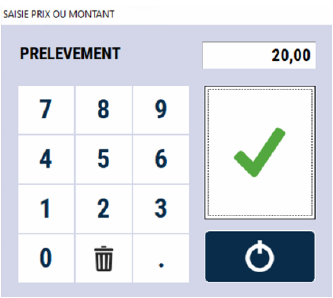

# Prélèvement

Cette fonction permet de **prélever des espèces** en cours de journée afin de soulager le tiroir. 

:::note
Il est important d’utiliser cette fonction pour que le tiroir soit juste en fin de journée et que la gestion coffre soit équilibrée.
:::

<li> Appuyez sur la touche : </li>

    

<li>  Saisissez le montant total du prélèvement </li> 

    

<li> Validez votre saisie </li>

----------------------------------

Il y a alors une **impression** pour contrôle, la joindre aux espèces remises au coffre

:::note
Le prélèvement apparaît distinctement sur la **clôture de caisse**. 
:::

Il est recommandé de faire un **prélèvement avant la clôture de fin de journée** pour faciliter le comptage du tiroir lors de la clôture.

----------------------------

Selon le paramétrage, S2Cash vous **alerte** lorsque vous avez **trop d’espèces dans votre tiroir**, et vous **incite à faire un prélèvement** si votre **palier maximum** est dépassé.

:::tip 
Vous pouvez ajuster ces paramètres depuis la gestion. Pour plus d'informations, vous pouvez cliquer sur le lien suivant : [Manuel de gestion - Mise à jour des options](https://aide.seg2inov.fr/docs/manuel-gestion/gestion-des-donnees/MAJ-options-magasin). 
:::