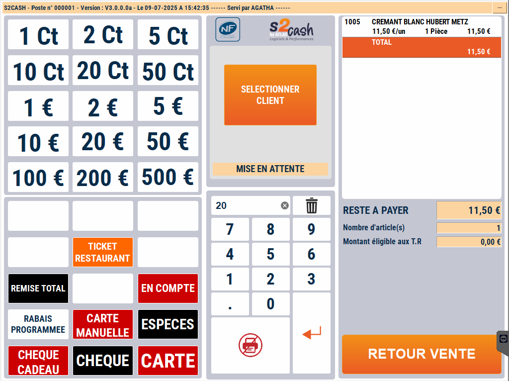

# Remise sur total

## Effectuer une remise sur le panier

Vous pouvez pratiquer une **remise en pourcentage sur la totalité de la vente**.

 <div className="contenaireImg">
    
    </div>

- 1/ Saisissez le pourcentage de remise
- 2/ Appuyez sur la touche :

    <div className="contenaireImg">
    
    </div>

 S2Cash vous demande alors de saisir le **motif de cette remise** avant de valider.

    <div className="contenaireImg">
        
    </div>

:::tip
La liste des motifs de remise est modifiable depuis la gestion. Pour plus d'informations, cliquez sur le lien suivant : [Manuel de gestion - Mise à jour des motifs de remise](https://aide.seg2inov.fr/docs/manuel-gestion/prix-promotions/mise-a-jour-motifs-remise).
:::

Une nouvelle ligne apparaît avec le montant de la remise. Le  ```RESTE A PAYER``` est mis à jour sur l’écran et sur la visu client. 
  
  Si votre remise est **incorrecte**, recommencez la fonction ou saisissez  ```0```  pour l’annuler.
  
   Le montant de la remise est **ventilé sur chaque produit** en proportion de sa valeur dans le ticket. 
   
:::note
La remise totale apparaît sur le **ticket de caisse** et sur la **clôture de fin de journée**.
:::

:::warning
Le système S2Cash peut être configuré avec une **remise sur total fixe**. Dans ce cas, quel que soit le montant saisi de la remise, le système applique toujours le **montant paramétré**.
::: 

## Message d'erreur

Dans le cas où vous saisissez un **montant de remise incorrect** (par exemple, 150%), la caisse affiche ce message : 

<div className="contenaireImg">
    
    </div>