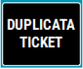
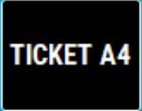
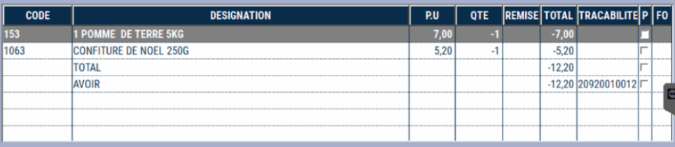
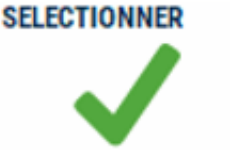
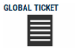

# Duplicata & réimpression ticket 

Vous pouvez **réimprimer une vente du jour ou d’une journée précédente** à la demande.


2 possibilités vous sont offertes suivant votre configuration :

<li> Imprimer un duplicata de ticket de caisse </li>

<li> Imprimer un ticket de caisse en format A4 </li>


| Bouton | Description | 
|:-----------:|-----------|
|| Pour réimprimer un ticket, appuyez sur la touche ```DUPLICATA TICKET```. Un ticket inscrit **DUPLICATA** s’imprime |
|| Pour imprimer un ticket de caisse sur l’imprimante A4 en réseau avec la caisse, appuyez sur la touche ```TICKET A4```|

Dans les 2 cas, S2Cash by ATLAS affiche d’abord tous les tickets du jour par caissier ou par caisse.

| Ecran | Description | 
|:-----------:|-----------|
|| Ecran global |
||Il est possible de rechercher un ticket sur une date antérieure. Tous les tickets de ce jour s’affichent, avec le détail en bas d’écran. |
||En bas de l’écran vous avez le détail du ticket sur lequel vous êtes positionné|
||Il est possible de faire une recherche sur un vendeur en particulier.|


Sélectionnez une date et appuyez sur :


<div className="contenaireImg">
    
</div>


Positionnez-vous sur le ticket recherché et appuyez sur :


<div className="contenaireImg">
    
</div>
