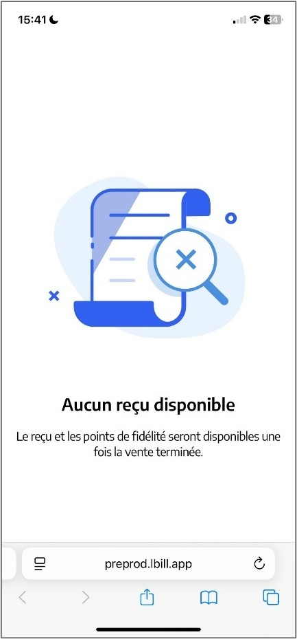

# Ticket papier et ticket électronique 

## L'impression ou la non-impression d'un ticket de caisse

Lors de la fin d’une transaction, vous pouvez **choisir ou non d’imprimer** un ticket de caisse. 

Vous devez le faire **après le** ```TOTAL PANIER```, mais **avant de finaliser la transaction**, c’est-à-dire avant l’encaissement. 

--------------------------------------

Pour **choisir** d’imprimer un ticket ou non, appuyez sur cette touche : 

| Affichage de la touche | Signification |
|:-----------:|-----|
|  | Le ticket sera **imprimé** sur l’imprimante ticket, et **aucun ticket électronique** ne sera généré. |
|   | Le ticket ne sera **pas imprimé**, mais un **ticket électronique sera généré**. |

Par défaut, la caisse est configurée de sorte à ce que le ticket de caisse ne soit **pas imprimé**. 

De plus, la caisse enregistre le **dernier état de la fonction**. 

:::tip
Par exemple, si l’on effectue une vente avec la fonction d’impression désactivée, lors du prochain règlement, par défaut l’impression sera désactivée également. Il faudra rappuyer sur la touche pour que le ticket soit imprimé. 
:::

## Ticket dématérialisé

Lorsque le ticket n’est pas imprimé, un **ticket électronique est généré**.

Pour **consulter** le ticket électronique, il vous suffit de **scanner votre QR CODE** avec votre téléphone.  

<div className="contenaireImg">
    
    </div>

Vous disposez d’**un QR CODE par caisse**, celui-ci étant **rattaché au poste** pour lequel il vous a été fourni. 

Ainsi, par exemple, lorsque que vous scannez le QR CODE rattaché à la caisse n°1, seul le dernier ticket de la caisse n°1 apparaitra. 

:::tip
Vous pouvez consulter et imprimer vos QR CODE depuis la gestion. Pour plus d’informations, cliquez sur le lien suivant : [Manuel de gestion - Affichage du QR CODE](https://aide.seg2inov.fr/docs/manuel-gestion/gestion-de-caisse/qr-code)
:::

---------------------------

:::warning 
Seul le dernier ticket de vente est disponible est format électronique. 
:::

Ainsi, plusieurs cas de figure : 

<li> Si vous effectuez une **nouvelle vente**, et que vous **n’imprimez pas le ticket**, **seul le ticket électronique de cette dernière vente** ne sera accessible en scannant le QR CODE. </li>
<li>	Si vous effectuez une **nouvelle vente**, et que vous **imprimez le ticket de caisse**, **aucun ticket** ne sera disponible en scannant le QR CODE. </li>

<div className="contenaireImg">
    
    </div>

:::note
Seuls les **tickets de caisse** suite à une **transaction** peuvent être au format électronique. Les **autres tickets et impressions**, tels que les duplicatas par exemple, ne peuvent faire l’objet d’un ticket dématérialisé, et seront **nécessairement imprimés**. 
:::