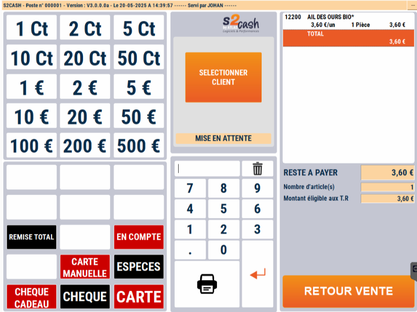
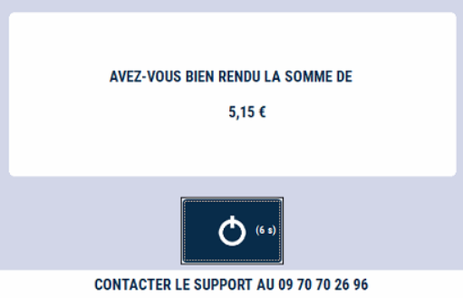

# Total panier

Lorsque vous avez fini de saisir la totalité des produits de votre client, appuyez sur la touche ```TOTAL``` pour faire apparaître le **montant à payer** et les différents **moyens de paiement acceptés**.


    <div className="contenaireImg">
    
    </div>

Vous pouvez, à tout moment, revenir en vente et effacer le Total avec la touche ```RETOUR VENTE```.

    <div className="contenaireImg">
    
    </div>

:::warning
Cette fonctionnalité est **impossible en cas de paiement partiel en carte bancaire**.
:::

## Multi-paiement 

Lors de l’encaissement, vous avez la possibilité de faire du **multi paiement**. Pour ce faire, renseignez le montant à l’aide du clavier et le mode de paiement grâce à la touche correspondante.

:::tip
Vous pouvez paramétrer la liste des paiements autorisés en caisse depuis le module de gestion. Pour plus d'informations, cliquez sur le lien suivant : [Manuel de gestion - Mise à jour des règlements](https://aide.seg2inov.fr/docs/manuel-gestion/gestion-de-caisse/maj-reglements).
:::

## Ticket restaurant 

Dans le cas des tickets restaurants, vous pouvez aussi les **scanner**. 

S2Cash contrôle leur validité et récupère le montant de chaque chèque.

## Rendu monnaie 

Si votre montant saisi dépasse le total à payer, S2Cash **calcule automatiquement le rendu de monnaie**, et l’affiche sur l’écran et sur le Ticket.

:::note
Pour rester en conformité avec la loi, un avoir sera généré pour les tickets restaurants dans le cas de trop perçu.
:::

| La caisse affiche le rendu monnaie à effectuer | Le ticket indique les différents modes de paiement et leurs montants associés, ainsi que le rendu monnaie |
|-----------|-----|
|  |    | 

:::note
Le rendu de monnaie est contrôlé pour chaque moyen de paiement en fonction de vos paramètres.
:::

## Message d'erreur 

Le total panier n'est accessible que si vous avez sélectionné **au moins un produit**. Ainsi, si vous appuyez sur la touche ```TOTAL``` alors que le **panier est vide**, ce message d'erreur s'affiche : 

<div className="contenaireImg">
    
    </div>

 Pour accéder au total panier, sélectionnez un ou plusieurs produits. 