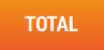

# Total panier


Lorsque vous avez fini de saisir la totalité des produits de votre Client, appuyez sur la touche ```TOTAL``` pour faire apparaître le **montant à payer** et les différents **moyens de paiement acceptés**.


    <div className="contenaireImg">
    
    </div>

Vous pouvez, à tout moment, revenir en vente et effacer le Total avec la touche ```RETOUR VENTE```.

    <div className="contenaireImg">
    
    </div>

:::warning
Cette fonctionnalité est **impossible en cas de paiement partiel en carte bancaire**.
:::

Lors de l’encaissement, vous avez la possibilité de faire du **multi paiement**.


Pour ce faire, renseignez le montant à l’aide du clavier et le mode de paiement grâce à la touche correspondante.


<li>Dans le cas des tickets restaurants, vous pouvez aussi les scanner. S2Cash by Atlas contrôle leur validité et récupère le montant de chaque Chèque.</li>


Si votre montant saisi dépasse le total à payer, S2Cash by Atlas **calcule automatiquement le rendu de monnaie**, et l’affiche sur l’écran et sur le Ticket.


Le Rendu de monnaie est contrôlé pour chaque Moyen de paiement en fonction de vos paramètres.

:::note
Pour rester en conformité avec la loi, un avoir sera généré pour les tickets restaurants dans le cas de trop perçu.
:::

| Affichage       | Explication |
|-----------|-----|
|  | La caisse affiche le rendu monnaie à effectuer. |
|        |  Le ticket indique les différents modes de paiement et leurs montants associés, ainsi que le rendu monnaie. |
