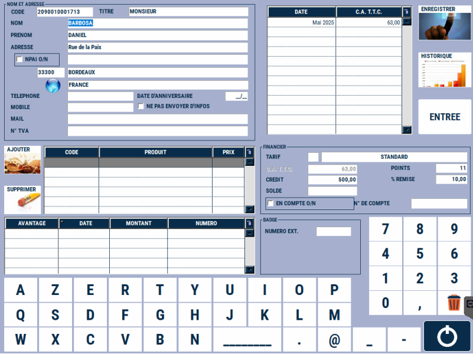
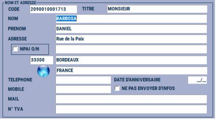
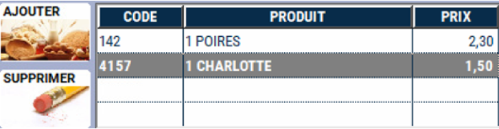
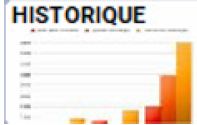
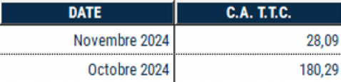
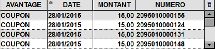
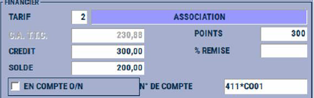
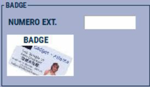
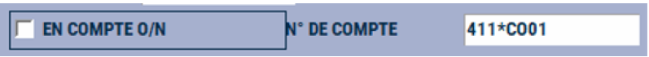

# La fiche client

La fiche client se compose ainsi :

| Visuel caisse | Visuel balance |
|:-----------:|:-----------:|
| |    |

## Modifications possibles

Vous pouvez **consulter** ou **modifier** les élements suivants :

### Le code ou numéro de client.

Ce code est généré **automatiquement** par S2Cash à la création du client.

    
    

### Les coordonnées du client

    
    

### Prix spécifiques

Vous avez la possibilité d’attribuer à ce client des **prix spécifiques pour certains produits**.

| Visuel caisse | Visuel balance |
|:-----------:|:-----------:|
| |    |

### L’historique du client

Vous pouvez accéder à l’historique du client.

    
    

### Le montant du chiffre d’affaires mensuel

Vous pouvez consulter le montant du chiffre d’affaires mensuel effectué par le client.

    
    

### Les coupons

Vous pouvez consulter les **coupons en cours** possédés par ce client.

    
    

### Tarif spécifique

Vous pouvez appliquer un **tarif spécifique** pour ce client.

**Consulter** ou **modifier** son **solde de points**, le **crédit maximum autorisé** et le **solde actuel de son compte**.
  

    
    

### Cartes clients

Dans le cas où c’est S2Cash qui gère vos cartes client, ce bouton permet d’imprimer un badge client sur une **imprimante badge**.

    
    

Si vous ne gérez pas les cartes client avec S2Cash, la ligne vide vous permet de renseigner un **numéro de badge externe**.

### En compte

    
    

Cochez cette case pour mettre le client en compte, c'est-à-dire enregistrer le client comme **entreprise** / **professionnel**. Le numéro de compte est automatiquement renseigné par S2Cash, vous avez la possibilité de le modifier.

--------------------------------------

:::tip
Vous pouvez également créer et modifier les fiches client depuis la gestion. Pour plus d'informations, cliquez sur le lien suivant : [Manuel de gestion - Mise à jour des clients](https://aide.seg2inov.fr/docs/manuel-gestion/clients/maj-clients).
:::