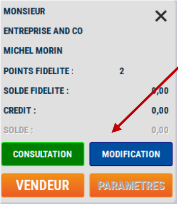

# Historique client

Une fois votre client associé à la vente, vous avez la possibilité de **visualiser son historique** (en caisse uniquement).

| Cliquez sur ```CONSULTATION``` | Puis ```HISTORIQUE``` |
|:--------------:|:--------:|
| | | 

Une nouvelle fenêtre s'ouvre : 

<div className="contenaireImg">
    
    </div>

On y retrouve 3 tableaux différents :
<li> La liste des **tickets clients** avec le **montant total**. </li>
<li> La liste de tous les **produits achetés par ce client** et le **CA TTC généré** depuis sa création. </li>
<li> Le **détail du ticket** sélectionné. </li>