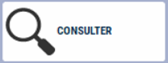
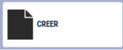

# Recherche Client

Pour **associer un client** à votre **vente**, vous devez le sélectionnez **avant le Total** :

<li> en lisant son badge </li>


<li> ou en appuyant sur la touche : </li>

<div className="contenaireImg">
    
    </div>

Une nouvelle fenêtre s'ouvre alors : 

<div className="contenaireImg">
    
    </div>

| Bouton       | Explication |
|:-----------:|----|
|      | Faire apparaitre la liste de **tous les clients**. |
|      | **Sélectionner** le client que vous souhaitez. |
|      | Rechercher un client en **saisissant les premières lettres** de son nom (ou son code, code postal) puis ```ENTREE```. |
|      | Consulter le **détail** de la fiche client. |
|      | **Créer un client** en appuyant sur la touche. NB : Le titre et le nom suffisent pour l’enregistrement d’un client. |
|      | **Modifier ou compléter** une fiche client. |