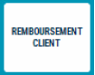
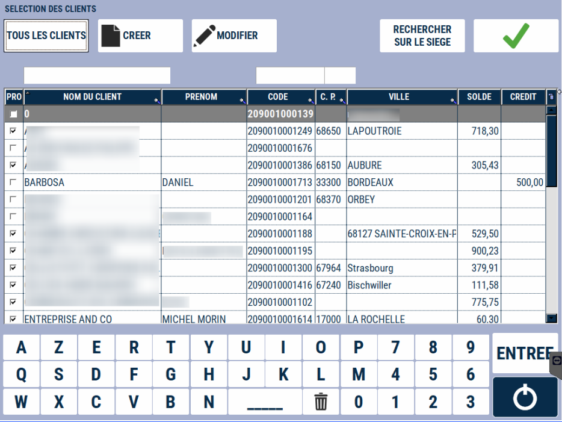
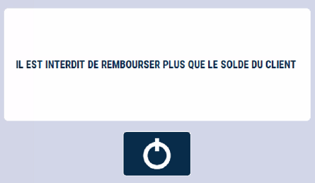

 # Remboursement client

 Le remboursement client est un **décaissement pour ajuster un solde client.**
<li> Il ne peut être utilisé que si le solde du client est négatif. </li>

Appuyez sur la touche :

    

La fenêtre de sélection du client s’affiche (cf. [Lien vers tutorial recherche et création client](/docs/manuel-caisse/client/recherche)).

    

Après avoir sélectionné le client : 

| Action       | Description |
|--------------|--------|
| | Saisissez le montant que vous souhaitez rembourser, puis validez. |
| | S2Cash contrôle le montant maximum autorisé en remboursement par rapport au solde du client. |

2 impressions : 1 pour le client et 1 à conserver pour archive.