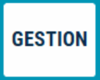
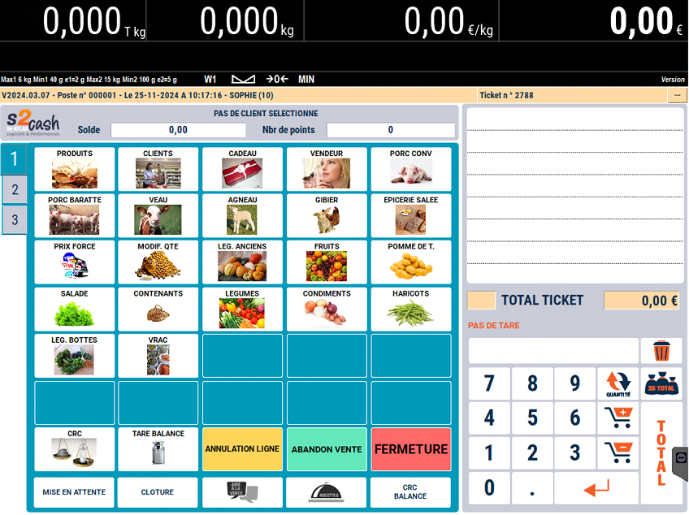

# Aspect visuel

:::warning
Attention : Les fonctionnalités des touches et leurs libellés sont conformes aux diverses règlementations. Toute modification du libellé de votre part relève de votre responsabilité. Il en va de même concernant l’usage que vous faites du logiciel.
:::

## Appuyez sur 1, 2 ou 3 pour accéder à l’un des trois écrans suivants :

|  |   |  | 
|-----------|-----------|-----------|
|Le 1er écran pour la **vente de produits**.| Le 2ème écran pour les fonctions diverses de caisse | Le 3ème écran pour les fonctionnalités propres à la caisse. Pour basculer dans la **Gestion** appuyez sur le bouton : 

 |

|  |  |
|-----------|-----------|
|Le 4ème écran, accessible **après le Total du panier** pour les remises sur le total et le règlement de la transaction. | En mode balance, on retrouve les mêmes configurations que le mode caisse en 3 ou 4 écrans, mais avec une barre de pesée en plus (située en haut ou sur le côté en fonction du modèle de la balance) |

&nbsp;

:::note
Ces configurations d’écrans ne sont que des exemples. Toutes les touches sont modifiables via le module S2Cash by ATLAS GESTION.
:::
:::warning
Comme pour les ventes, toutes les opérations qui nécessitent une manipulation des espèces sont enregistrées dans la Caisse, de façon à ce que le tiroir soit juste en fin de journée.
S2Cash by Atlas enregistre donc :
<li>Les dépenses de caisse</li><li>Les recettes de caisse</li><li>Les prélèvements d’espèces</li><li>Les apports de monnaie</li><li>Les règlements client</li><li>Les remboursements client</li>
:::

