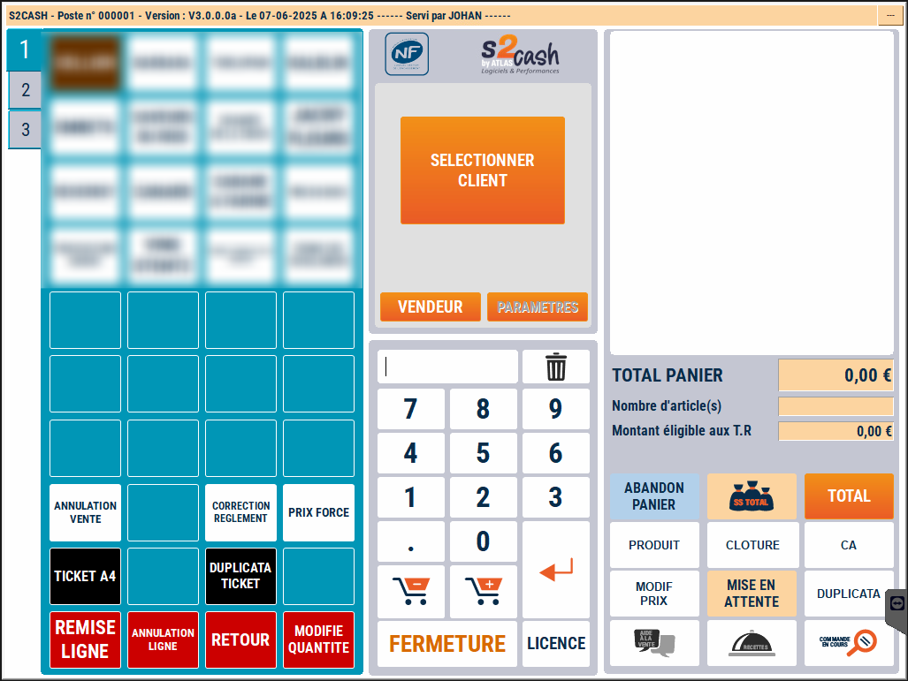
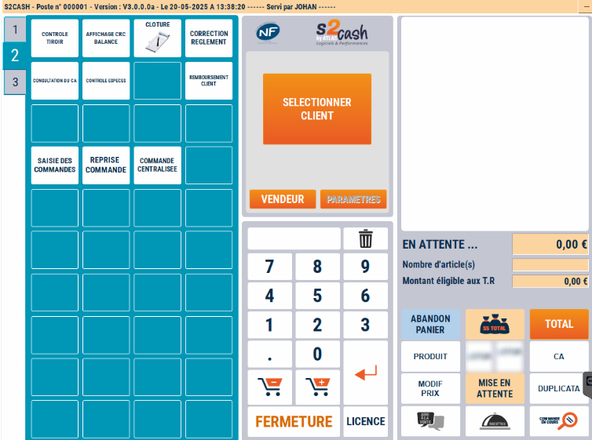
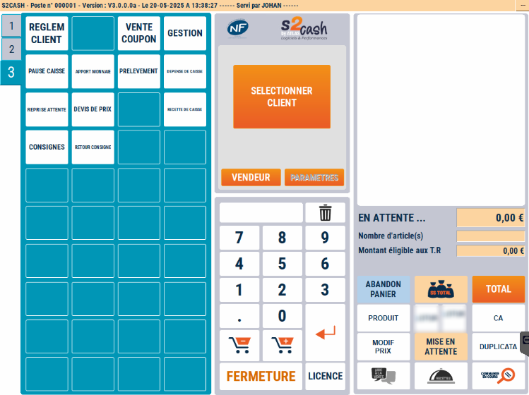
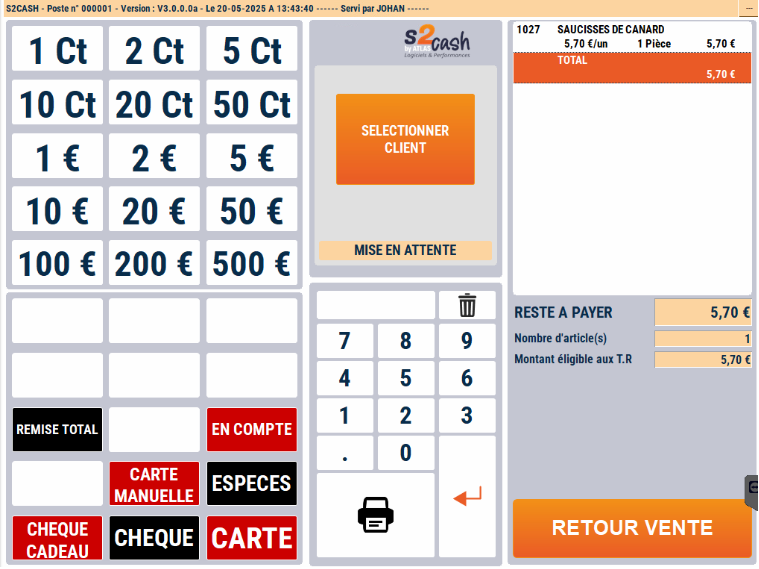

# Aspect visuel

:::warning
Les fonctionnalités des touches et leurs libellés sont conformes aux diverses règlementations. Toute modification du libellé de votre part relève de votre responsabilité. Il en va de même concernant l’usage que vous faites du logiciel.
:::

## Appuyez sur 1, 2 ou 3 pour accéder à l’un des trois écrans suivants :

|  |   | 
|:-----------:|:-----------:|
|Le 1er écran pour la **vente de produits**.| Le 2ème écran pour les **fonctions diverses de caisse**. | 

|  |  | 
|:-----------:|:-----------:|
|Le 3ème écran pour les **fonctionnalités propres à la caisse**. | Le 4ème écran, accessible **après le Total du panier** pour les remises sur le total et le règlement de la transaction. | 

:::note
Comme pour les ventes, toutes les opérations qui nécessitent une manipulation des espèces sont enregistrées dans la Caisse, de façon à ce que le tiroir soit juste en fin de journée.
S2Cash by Atlas enregistre donc :
<li>Les dépenses de caisse</li><li>Les recettes de caisse</li><li>Les prélèvements d’espèces</li><li>Les apports de monnaie</li><li>Les règlements client</li><li>Les remboursements client</li>
:::

## Visuel balance

En mode balance, on retrouve approximativement les mêmes configurations que le mode caisse en 3 ou 4 écrans, mais avec une **barre de pesée en plus** (située en haut ou sur le côté en fonction du modèle de la balance). 

    
    

Par ailleurs, certaines fonctionnalités n'apparaissent pas systématiquement sur la partie droite de l'écran comme sur la caisse. 

Ces fonctionnalités se trouvent notamment **en bas du 1er clavier** sur l'exemple ci-dessus. 

:::tip
Ces configurations d’écrans ne sont que des **exemples**. Toutes les **touches sont modifiables** via le module S2Cash Gestion. Pour plus d'informations, vous pouvez cliquer sur le lien suivant : [Manuel de gestion - Mise à jour du clavier caisse/balance.](https://aide.seg2inov.fr/docs/manuel-gestion/claviers/maj-clavier-caisse-balance/)
:::

&nbsp;